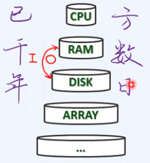
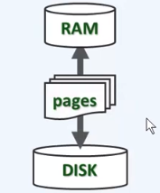
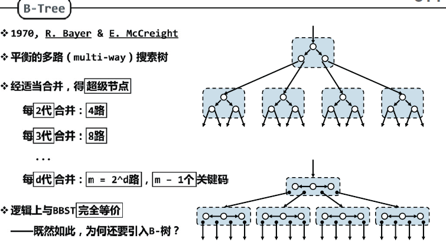
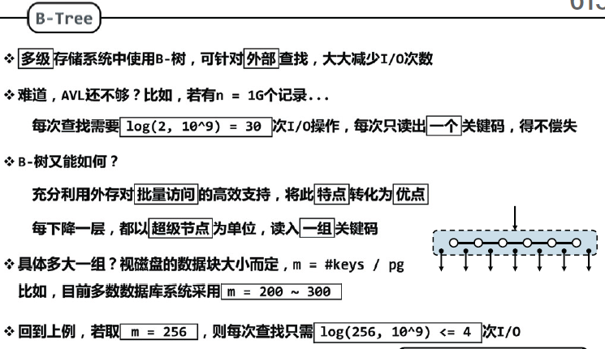
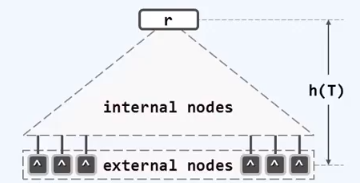
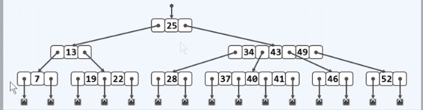
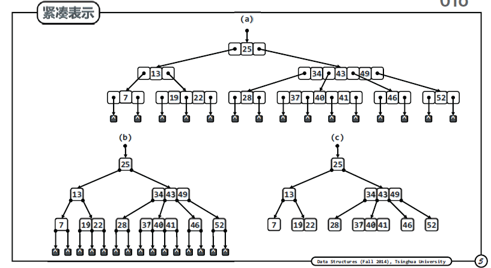

## 动机

**内存在“变小”**：内存虽然在不断变大，但是相对于实际需要(PB级别的数据)是在不断变小，而内存十分昂贵,

物理上存储容量和速度需要取舍。

**事实1**：不同容量的存储器，访问速度相差悬殊，以磁盘和内存为例，ms/ns  > 10的5次方。这实际是1秒和1天的差别，访问内存需要1s，则访问外存需要一天。为了避免一次外存访问我们宁可访问内存千百遍。

分级IO:

多数的存储系统，都是分级组织的--cacheing

  最常用的放在更高层，更小的存储器中，实在找不到才从更低级更大的"外存"IO读取。

**1B = 1KB**

**事实2**：从磁盘读写1B，与读写1KB几乎一样快。

比喻：买一个粉笔和买一车粉笔。

这也就是批量访问：以”页“page和”块“block为单位，使用缓冲区

## B树结构

更宽更矮

##### 平衡的多路搜索树 multi-way

**多路合并**

可以由二叉树经适当合并，得到超级节点。

每2代合并    4路

每3代合并    8路

**节省IO**

多级存储节点中使用B树，可以大大减小IO次数，每下降一层，读入一组关键码。

**深度统一**

m阶B树，m路平衡搜索树（m>=2）  树高h = 外部节点的深度

外部节点(叶子节点数值为空，并不存在的孩子)深度统一

所有叶节点深度统一

4阶B树中每个节点的分支数为：

2~4 

**紧凑表示**

