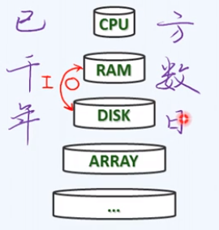

### B树动机

**内存在“变小”**：内存虽然在不断变大，但是相对于实际需要(PB级别的数据)是在不断变小，而内存十分昂贵,

物理上存储容量和速度需要取舍。

**事实1**：不同容量的存储器，访问速度相差悬殊，以磁盘和内存为例，ms/ns  > 10的5次方。这实际是1秒和1天的差别，访问内存需要1s，则访问外存需要一天。为了避免一次外存访问我们宁可访问内存千百遍。

**分级IO**:

多数的存储系统，都是分级组织的--cacheing

  最常用的放在更高层，更小的存储器中，实在找不到才从更低级更大的"外存"IO读取。

**1B = 1KB**

事实2：从磁盘读写1B，与读写1KB几乎一样快。

比喻：买一个粉笔和买一车粉笔。

这也就是批量访问：以”页“page和”块“block为单位，使用缓冲区

