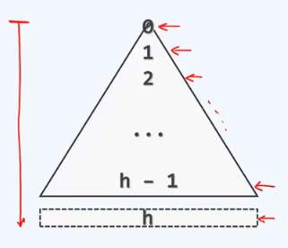
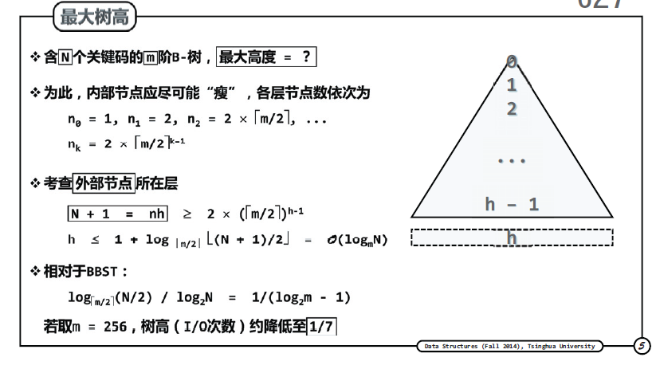
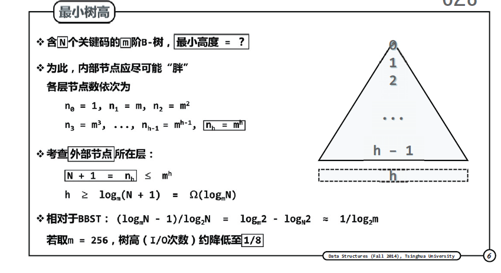

5阶B树 （3-5 树） 每个节点 3 - 5 个分支

**B树查找算法实现**

r = k.search(v)

r = r+1

B树查找算法若最终失败，返回值为：

None

**NULL**

A pointer to the last examined node 指向最后一个所查找节点的指针

A pointer to the root 指向根节点的指针

**主次成本**

约定： 根节点常驻RAM内存

- 忽略内存中的查找，运行时间主要取决于IO次数

- 每一深度，多一次IO
- 运行时间 = 节点深度 = O(h)

再次强调 b 树的树高是由外部节点的深度决定的

最大树高？ 

**N个内部节点，N+1个外部节点**
N种成功的可能，N+1种失败的可能

N个关键码的m阶B树的最大树高为？
.

最小树高？

https://www.jianshu.com/p/3a9e5d536e47
