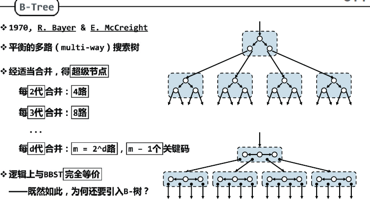
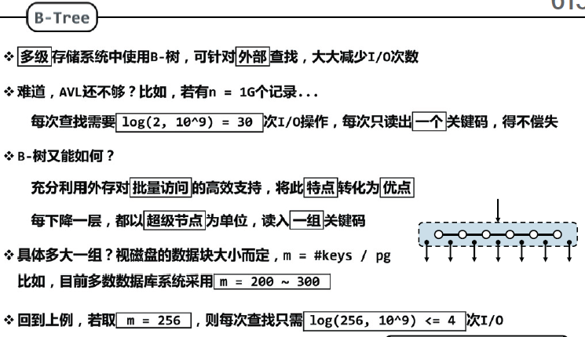
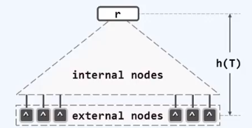
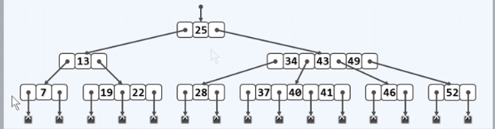
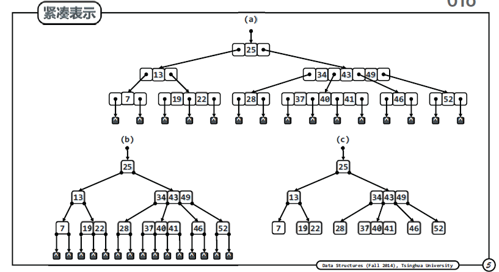

### B树结构

更宽更矮

##### 平衡的多路搜索树 multi-way

**多路合并**

可以由二叉树经适当合并，得到超级节点。

每2代合并    4路

每3代合并    8路

**节省IO**

多级存储节点中使用B树，可以大大减小IO次数，每下降一层，读入一组关键码。

**深度统一**

m阶B树，m路平衡搜索树（m>=2）  树高h =外部节点的深度

外部节点(叶子节点数值为空，并不存在的孩子)深度统一

所有叶节点深度统一

4阶B树中每个节点的分支数为：

2~4 

**紧凑表示**

