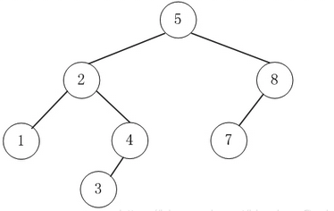

## 介绍
> AVL树是根据它的发明者G. M. Adelson-Velskii和E. M. Landis命名的。它是一种特殊的二叉搜索树。AVL树要求: 任一节点的左子树深度和右子树深度相差不超过1

- AVL树是一棵二叉搜索树。
- AVL树的左右子节点也是AVL树。
- AVL树拥有二叉搜索树的所有基本特点。
- 每个节点的左右子节点的高度之差的绝对值最多为1，即平衡因子为范围为[-1,1]。

## 动机

基础的二叉搜索树构建出来可能会存在不平衡的现象，比如极端情况下，按照`A B C D E F G H`顺序插入树中，结果为一个“单链表”.

但实际上我们更想要平衡一点的二叉搜索树，因为平衡的二叉搜索树能有效提高查询效率，比如上面的要查询“H”节点则需要比较8个节点才找到，而平衡的二叉搜索树只需要比较3个节点。

所以AVL树的出现就是为了解决平衡性问题，它的核心内容就是平衡处理机制，即所谓的旋转，一共有四种形式的旋转：**右单旋、左单旋、左右双旋和右左双旋**。

