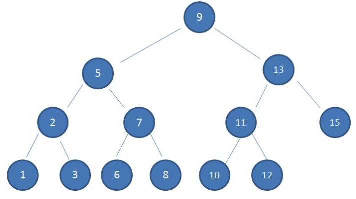
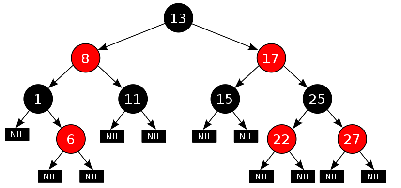

## 回顾BST,AVL

### BST 二叉查找树

- 若任意结点的左子树不空，则左子树上所有结点的值均小于它的根结点的值；
- 若任意结点的右子树不空，则右子树上所有结点的值均大于它的根结点的值；
- 任意结点的左、右子树也分别为二叉查找树。
- 没有键值相等的结点（no duplicate nodes）



查找次数等于二叉树高度.

普通的二叉查找树是不平衡的,查找性能不高.

在最坏情况下,二叉查找树退化成了一棵具有n个结点的线性链后，则增删改查的操作最坏情况运行时间为O（n）。

### AVL

平衡二叉查找树.

**AVL是一种高度平衡的二叉树，所以通常的结果是，维护这种高度平衡所付出的代价比从中获得的效率收益还大**，故而实际的应用不多，更多的地方是用**追求局部而不是非常严格整体平衡的红黑树**。

当然，如果场景中**对插入删除不频繁，只是对查找特别有要求，AVL还是优于红黑树的**。


## 红黑树介绍

**红黑树，本质上来说就是一棵相对平衡的二叉查找树**，它在二叉查找树的基础上增加了着色和相关的性质使得红黑树**相对平衡**，从而保证了红黑树的查找、插入、删除的时间复杂度最坏为O(log n)。

```java
1）每个结点要么是红的，要么是黑的。  
2）根结点是黑的。  
3）每个叶结点（叶结点即指树尾端NIL指针或NULL结点）是黑的。  
4）如果一个结点是红的，那么它的两个子节点都是黑的。  
5）对于任一结点而言，其到叶结点树尾端NIL指针的每一条路径都包含相同数目的黑结点。  
```



### 特性 最长路径不会超过最短路径的两倍


https://github.com/julycoding/The-Art-Of-Programming-By-July/blob/master/ebook/zh/03.01.md


## 优点

**红黑树的查询性能略微逊色于AVL树**，因为他比avl树会稍微不平衡最多一层，也就是说红黑树的查询性能只比相同内容的avl树最多多一次比较，但是，红黑树在插入和删除上完爆avl树，avl树每次插入删除会进行大量的平衡度计算，**而红黑树为了维持红黑性质所做的红黑变换和旋转的开销，相较于avl树为了维持平衡的开销要小得多**.